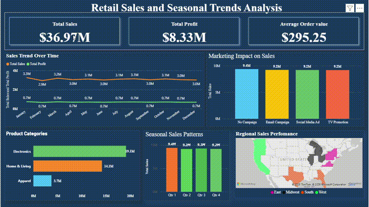
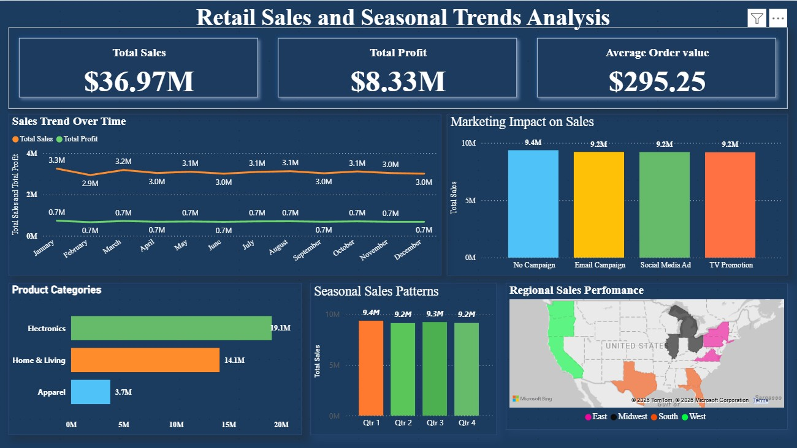

# 🛍️ Retail Sales & Seasonal Trends Analysis (Power BI)

An interactive Power BI dashboard analyzing **50,000 retail order records** to uncover seasonal sales patterns, marketing campaign effectiveness, product category performance, and regional sales distribution across the US.

## 🎥 Demo



## 📊 Dashboard Preview



## 🎯 Objective

Help retail management understand sales drivers, evaluate marketing campaign ROI, identify top-performing product categories, and uncover regional and seasonal trends to guide inventory and marketing decisions.

## 📌 Key Performance Indicators

| KPI | Value |
|---|---|
| Total Sales | $36.97M |
| Total Profit | $8.33M |
| Average Order Value | $295.25 |
| Profit Margin | ~22.5% |

## 🔍 Key Insights

**1. Sales are remarkably stable month-to-month**
- Monthly sales hover tightly between **$2.9M–$3.3M**, with January slightly higher ($3.3M) and a gentle decline through mid-year ($2.9M–$3.1M).
- Profit is consistently **~$0.7M/month** — a stable ~22-23% margin across the year, indicating predictable, low-volatility revenue (typical of a diversified retail mix rather than a seasonal-only business).

**2. Marketing campaigns show measurable lift over no campaign**
- **No Campaign** generates **$9.4M** in sales — the highest single bucket.
- **Email Campaign ($9.2M)**, **Social Media Ad ($9.2M)**, and **TV Promotion ($9.2M)** are all very close to each other and slightly below "No Campaign."
- This suggests campaigns are **not currently driving incremental lift** over baseline — worth investigating whether campaigns are reaching the right segments, or if "No Campaign" periods simply cover more calendar time.

**3. Electronics is the dominant product category**
- **Electronics: $19.1M** (largest share by far)
- **Home & Living: $14.1M**
- **Apparel: $3.7M** (smallest, ~10% of total sales)
- Electronics + Home & Living together make up **~90% of total sales** — Apparel may be underperforming or under-promoted.

**4. Seasonal sales patterns by quarter**
- **Qtr 1: $9.4M** (highest)
- **Qtr 3: $9.3M**
- **Qtr 2 & Qtr 4: $9.2M** each
- Sales are very evenly distributed across quarters (within a $0.2M band), reinforcing the "stable demand" pattern seen in the monthly trend — there's no extreme seasonal spike or trough.

**5. Regional sales performance (US map)**
- Sales are tracked across **East, Midwest, South, and West** regions, with visible activity concentrated in states like **California (West), Texas (South), and the Midwest/Northeast corridor**.
- Regional breakdown by exact values would help identify whether the South or West region is over/under-indexed relative to population — a good next-step drill-down.

## 🛠️ Tools & Techniques Used

- **Power BI Desktop** — Data Modeling, DAX Measures, Interactive Visuals
- **Visuals Used:** KPI Cards, Line Chart (dual-axis), Clustered Bar/Column Charts, Map Visual, Filter Pane
- **DAX Measures:** Total Sales, Total Profit, Average Order Value, Profit Margin
- **Data Source:** 50,000-row retail orders dataset (Order, Date, Region, State, Category, Product, Campaign, Sales, Profit, Discount, Season/Event)

## 📁 Repository Structure

```
retail-sales-dashboard/
├── Retail_Sales.pbix                    # Power BI dashboard file
├── data/
│   └── retail_sales_50k_dataset.csv.gz  # Source dataset (50K rows, compressed)
├── assets/
│   ├── retail_demo_preview.gif          # Dashboard walkthrough preview
│   └── Retail_Sales.jpg                 # Dashboard screenshot
└── README.md
```

## 🔍 Dataset Fields

`Order_ID`, `Order_Date`, `Year`, `Month`, `Quarter`, `Region`, `State`, `Category`, `Product`, `Campaign`, `Orders`, `Sales`, `Profit`, `Discount_Pct`, `Season_Event`

## ▶️ How to Use

1. Download `Retail_Sales.pbix`
2. Open in **Power BI Desktop**
3. Use the filter pane / slicers to drill down by Region, Category, or Campaign
4. Hover over visuals for tooltips and detailed breakdowns

## 💡 Recommendations

- **Audit campaign targeting** — current campaigns show no clear lift over baseline; consider A/B testing creative/audience segments
- **Investigate Apparel underperformance** — explore pricing, assortment, or promotional gaps vs. Electronics/Home & Living
- **Deep-dive regional performance** — add per-state sales figures to identify expansion or consolidation opportunities
- **Leverage the stable demand pattern** for more predictable inventory planning and staffing

## 👤 Author

**Sumanth** — Data Analyst | SQL | Power BI (PL-300) | Excel 
